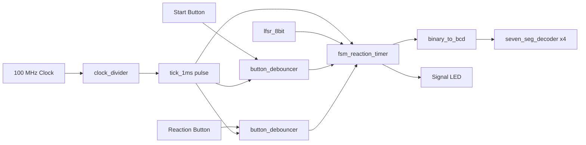
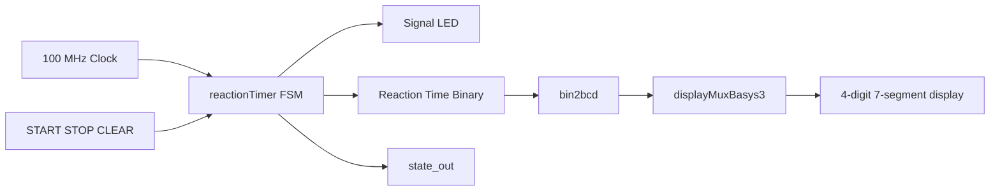
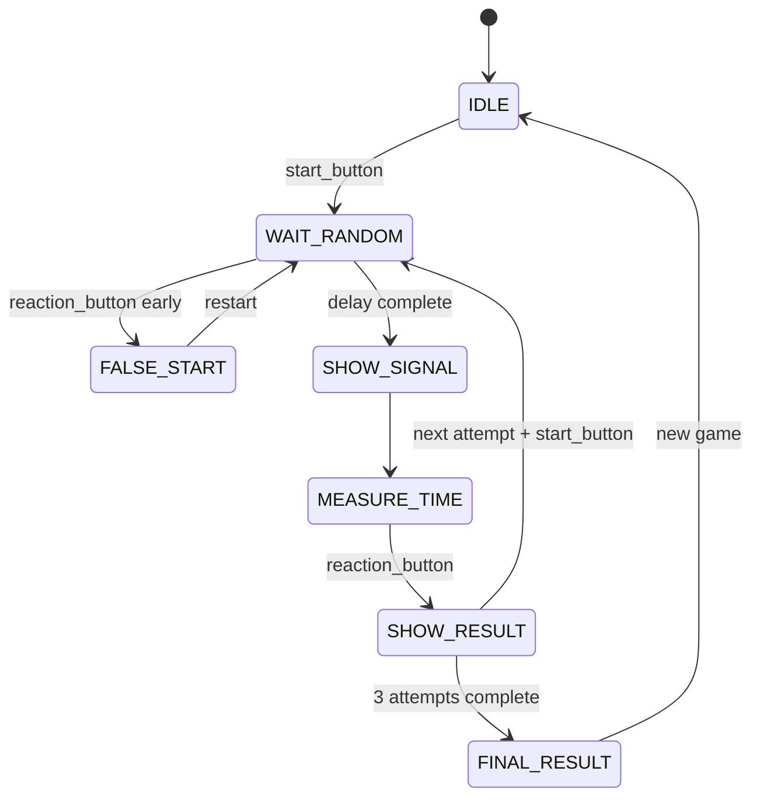

# Reaction Time Game (Basys3 FPGA)

This repository contains Verilog implementations of an FPGA reaction time game for the Basys3 board.
It includes two related tracks:

1. A modular FSM-based prototype in the repository root.
2. A more integrated Reaction Time Calculator design in `Reaction Time Calculator/` with 7-segment display support and VGA experiments.

## State Diagram (Primary)


## Table of Contents

1. [Project Goals](#project-goals)
2. [Project Visuals](#project-visuals)
3. [Repository Layout](#repository-layout)
4. [System Architecture](#system-architecture)
5. [FSM Behavior](#fsm-behavior)
6. [Module Descriptions](#module-descriptions)
7. [Simulation Guide](#simulation-guide)
8. [Hardware Bring-Up (Basys3)](#hardware-bring-up-basys3)
9. [Constraints and Pin Mapping Notes](#constraints-and-pin-mapping-notes)
10. [Known Issues and Notes](#known-issues-and-notes)
11. [Future Improvements](#future-improvements)

## Project Goals

- Measure human reaction time in milliseconds.
- Use a randomized wait interval before the user signal.
- Display measured time on seven-segment display hardware.
- Support repeated attempts and average computation (prototype FSM path).
- Verify functionality through simulation testbenches and hardware tests.

## Project Visuals

### Top-Level and RTL Diagrams


### Module Diagrams


#### Reaction Time Module

- The `reactionTimer` module is the top-level controller in this track.
- Its main FSM has four states: `idle`, `load`, `timing`, and `w2c`.
- During `load`, it runs a randomized countdown (3-10 seconds).
- During `timing`, it measures reaction time in milliseconds (up to 9999 ms) and controls the LED.
- After `stop`, it triggers `bin2bcd` to convert binary reaction time into BCD digits.
- The `displayMuxBasys3` module multiplexes four digits and drives seven-segment outputs (`an`, `sseg`) so the measured time appears on the Basys3 display.
- In short: control/timing lives in `reactionTimer`, conversion is handled by `bin2bcd`, and display scanning is handled by `displayMuxBasys3`.


#### VGA Module

- The `vga_number_top` module is a wrapper that connects timing generation and pixel rendering.
- `vga_sync` generates VGA timing signals (`hsync`, `vsync`), active-video gating (`video_on`), and pixel coordinates (`x`, `y`).
- `vga_number_display` uses those coordinates to decide where each digit pixel should appear on screen.
- `digit_font` acts as a small 8x8 bitmap ROM for digit glyph rows, providing pixel patterns for rendering digits.
- The renderer scales and positions digits around the screen center and outputs RGB color data.
- In short: `vga_sync` defines when/where to draw, `digit_font` defines what each digit looks like, and `vga_number_display` converts that into visible pixels.

### Timing and Implementation Screenshots


## Repository Layout

```text
Reaction-time-game/
|- binary_to_bcd.v
|- button_debouncer.v
|- clock_devider.v
|- fsm_reaction_timer.v
|- lfsr_8bit.v
|- seven_seg_decoder.v
|- tb_*.v
|- Basys3.xdc
|- Reaction Time Calculator/
|  |- reactionTimer.v
|  |- bin2bcd.v
|  |- displayMuxBasys3.v
|  |- vga_*.v
|  |- tb_*.v
|  |- run_tb_*.sh
|  |- Basys3.xdc
|  |- hardware_tester_guide.md
|- Vivado-project-files/
```

## System Architecture

### Root Prototype Dataflow



### Calculator Track Dataflow



## FSM Behavior

### Root FSM (`fsm_reaction_timer.v`)

State set (one-hot encoded):

- `IDLE`
- `WAIT_RANDOM`
- `SHOW_SIGNAL`
- `MEASURE_TIME`
- `FALSE_START`
- `SHOW_RESULT`
- `FINAL_RESULT`



Notes:

- In the current root FSM, `random_delay_ms` is fixed to `2` for quick testing.
- The module tracks up to 3 attempts and computes `average_time`.

### Calculator FSM (`Reaction Time Calculator/reactionTimer.v`)

States (2-bit encoded):

- `idle`: waiting for `start`
- `load`: randomized countdown running (3-10 seconds)
- `timing`: user reaction timing window, LED on
- `w2c`: wait for clear

## Module Descriptions

### Root Modules

- `clock_devider.v` (`clock_divider`): generates periodic tick pulse from 100 MHz clock.
- `button_debouncer.v`: synchronizes noisy pushbutton input and creates a clean pulse.
- `lfsr_8bit.v`: pseudo-random generator (8-bit LFSR) for randomized delay behavior.
- `fsm_reaction_timer.v`: game controller, false-start detection, attempt accumulation, average computation.
- `binary_to_bcd.v`: combinational double-dabble conversion of 16-bit binary to BCD.
- `seven_seg_decoder.v`: BCD-to-seven-segment mapping.

### Calculator Track Modules

- `Reaction Time Calculator/reactionTimer.v`: integrated reaction timer with FSM and timing counters.
- `Reaction Time Calculator/bin2bcd.v`: sequential (FSM-based) binary-to-BCD converter.
- `Reaction Time Calculator/displayMuxBasys3.v`: Basys3 4-digit display multiplexing.
- `Reaction Time Calculator/vga_sync.v`, `vga_number_display.v`, `vga_number_top.v`: VGA experiments and number rendering support.

## Simulation Guide

The repository is set up around Xilinx simulation tools (`xvlog`, `xelab`, `xsim`).

### Calculator Track (Scripts Provided)

From `Reaction Time Calculator/`:

```bash
bash run_tb_bin2bcd.sh
bash run_tb_display.sh
bash run_tb_reaction.sh
```

Each script compiles source + testbench, elaborates, then runs simulation.

### Root Modules (Manual Flow)

Example XSIM command sequence:

```bash
xvlog binary_to_bcd.v button_debouncer.v clock_devider.v lfsr_8bit.v seven_seg_decoder.v fsm_reaction_timer.v tb_fsm_reaction_timer.v
xelab tb_fsm_reaction_timer -s sim_fsm
xsim sim_fsm -R
```

Run similar commands for:

- `tb_lfsr_8bit.v`
- `tb_clock_devider.v`
- `tb_button_debouncer.v` (see known issue below)

## Hardware Bring-Up (Basys3)

1. Create/open a Vivado project.
2. Add design sources and constraints file for your selected track.
3. Set top module:
   - Root prototype: your integration top (or test wrapper) using `fsm_reaction_timer`.
   - Calculator track: `reactionTimer`.
4. Run synthesis -> implementation -> bitstream generation.
5. Program the Basys3 board and validate button/LED/display behavior.

For detailed physical validation procedures, see:

- `Reaction Time Calculator/hardware_tester_guide.md`

## Constraints and Pin Mapping Notes

Two different constraint styles exist in this repo:

1. Root `Basys3.xdc`
   - Uses JA Pmod-style signals (`start`, `stop`, `clear`, `led_esp`) and also includes an older LED mapping.
2. `Reaction Time Calculator/Basys3.xdc`
   - Uses onboard buttons and standard seven-segment/VGA mappings.

Always confirm your top-level port names match the selected `.xdc` file.

## Known Issues and Notes

- File naming typo: `clock_devider.v` contains module `clock_divider`.
- `tb_button_debouncer.v` instantiates `button_debouncer_simple`, while the root module file defines `button_debouncer`.
- Root FSM currently hardcodes random delay to 2 ms for rapid simulation (`random_delay_ms = 2`).
- The calculator track and root track are similar but not identical architectures; use matching constraints and testbenches per track.

## Future Improvements

- Add a unified top-level module for the root track that directly targets Basys3 onboard I/O.
- Parameterize random delay range in the root FSM instead of using fixed 2 ms.
- Add automated regression scripts for all root testbenches.
- Add screenshots, oscilloscope captures, and waveform snapshots from the project presentation.
- Add CI checks (lint + simulation smoke tests) for reproducibility.
